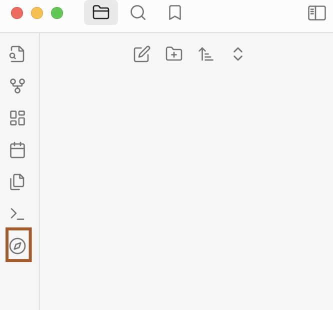
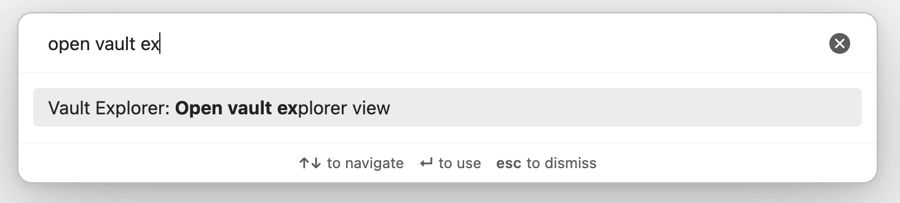

Welcome to the Vault Explorer documentation. This tutorial will cover a few basics to help you get started with the plugin.

## Installation
If you haven't done so already, install the [Vault Explorer plugin](https://obsidian.md/plugins?id=vault-explorer) from the community plugin store.

## Open the explorer view

Open the explorer view by clicking on the compass icon in the left-hand sidebar.

You may also run **Open vault explorer view** from the [command palette](https://help.obsidian.md/Plugins/Command+palette).

 

## Change views

Views are different visual formats for displaying your vault files. When you first open the explorer view, the [Grid view](/docs/views/grid) is active.

To change to another view, click one of the view tabs.

<video src="https://vaultexplorer.b-cdn.net/view-tabs.mov" controls="controls" style="max-width: 100%;">
  Your browser does not support the video tag.
</video>

 

To reorder the view tabs, drag one tab and drop it onto another tab.

<video src="https://vaultexplorer.b-cdn.net/reorder-view-tabs.mov" controls="controls" style="max-width: 300px">
  Your browser does not support the video tag.
</video>

## Filter by favorites

Filters allow you to control what is displayed in a view.

One of the basic filters is the [favorite filter](/docs/filters/favorite-filter). The favorite filter allows you to only display notes that contain a favorite property with a value of `true`.

You must set a property before using the favorite filter

1. Open the plugin settings by clicking the gear icon in the upper right hand corner
2. Under the `Built-in Properties` section, find the `Favorite property` setting
3. Click the dropdown and select a property

If no properties are listed, please add a [checkbox property](https://help.obsidian.md/Editing+and+formatting/Properties) to one of your notes. This property will then appear in the dropdown list.

<video src="https://vaultexplorer.b-cdn.net/favorite-filter-1.mov" controls="controls" style="max-width: 100%;">
  Your browser does not support the video tag.
</video>

 

Now go to back to the explorer view, and click the favorites checkbox. The view will now only display notes that have the favorite property.

:::info
The favorite filter is applied on top of other filters such as the timestamp filter or the custom filter.
:::

<video src="https://vaultexplorer.b-cdn.net/favorite-filter-2.mov" controls="controls" style="max-width: 100%;">
  Your browser does not support the video tag.
</video>

## Create a custom filter group

The custom filter gives you granular control over what should displayed in a view. The custom filter is organized into filter groups and filter rules. A filter group can have many filter rules.

Let's start by creating a note with a frontmatter block. Add a `tags` property with a `test` tag in it.

<video src="https://vaultexplorer.b-cdn.net/custom-filter-1.mov" controls="controls" style="max-width: 100%;">
  Your browser does not support the video tag.
</video>

Now create a filter group.

1. Click the button with 3 vertical dots (Change custom filter)
2. Click the button on the left with a plus (Add filter group)

<video src="https://vaultexplorer.b-cdn.net/custom-filter-2.mov" controls="controls" style="max-width: 100%;">
  Your browser does not support the video tag.
</video>

Next, we will add a filter rule to the filte rgroup.

1. Click the button on the right with a plus icon (Add filter rule).
2. Click the property type dropdown. Change it from `text` to `list`
3. Then, click the property name dropdown. Change it from `Select a property` to `tags`
4. Add a value of `test` to the text field. You do not need to include a #.
5. Finally, click outside of the modal.

<video src="https://vaultexplorer.b-cdn.net/custom-filter-3.mov" controls="controls" style="max-width: 100%;">
  Your browser does not support the video tag.
</video>

Now let's enable our filter group.

Click the filter group to enable it. Click it again to disable it.

With the filter group enabled, you will only see notes that have a `tags` property containing a `test` value.

<video src="https://vaultexplorer.b-cdn.net/custom-filter-4.mov" controls="controls" style="max-width: 100%;">
  Your browser does not support the video tag.
</video>

## Congratulations

Congratulations! You have just learned the basics of using the Vault Explorer plugin.

## What's next?
- Learn more about [custom filter rules](/docs/filters/custom-filter#filter-rules)
- Learn about [Premium](/docs/premium)